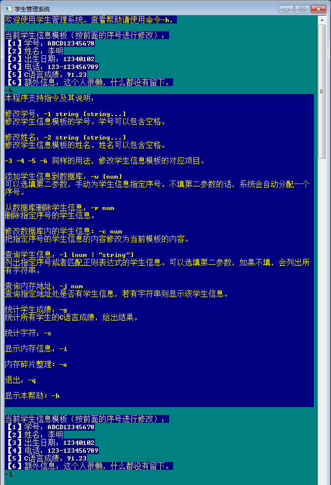

# Simple CRUD with C

Within a fixed-size char-array, carry out Create, Read, Update and Delete operations upon entries like student information.

Video Demo: [Vimeo](https://vimeo.com/435030770)

Executable File Download: [Google Drive](https://drive.google.com/drive/folders/1Sb2Y1ipML-kFS5f1aiZxy29MEQIYZlSB?usp=sharing)

Features:
- The char-array can automatically get enlarged when space is insufficient
- One-letter style command prompt interface, with basic input validation
- Regular expression support
- Data is persistently stored in disk files
- Within the array, roughly simulated managerial operations like allocating space, extending space and defragmentation
- Full functionality introduction is displayed with '-h' command in program

---

# C语言简单增删改查

在固定大小的字节数组中，对信息（例如学生信息）实现了增、删、改、查操作。

演示视频：[BiliBili](https://www.bilibili.com/video/BV1jD4y1Q733/)

可执行文件下载：[蓝奏云](https://wws.lanzous.com/ipKILe9u36h)

特色：
- 数组可以在空间不足时自动扩容
- 单字母命令风格的控制台交互界面，有基本的输入检查
- 支持正则表达式
- 数据实时保存在硬盘文件中
- 在数组内部，简单地模拟了一些管理操作，比如空间分配、空间扩容和碎片清理
- 详细功能介绍可进入程序用'-h'指令查看

